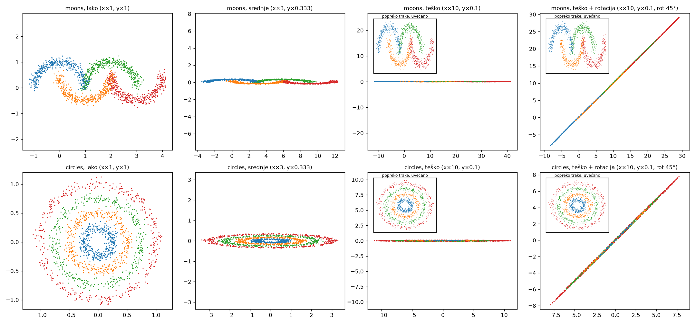
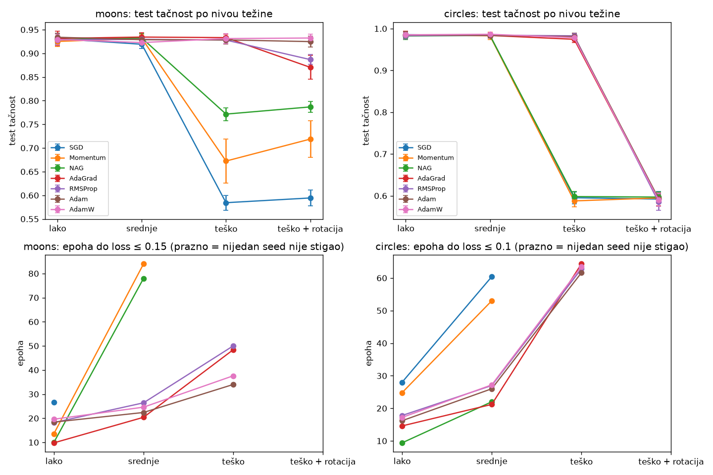

# Optimizacija

Implementacije sedam gradijentnih optimizatora uNumPy-ju i njihovo poređenje na klasifikaciji skupova moons, circles, MNIST i Covertype (male neuronske mreže, mini-batch trening). Fokus je na POREĐENJU KAKO optimizatori rade (brzina, stabilnost).

Glavni eksperiment: moons i circles na četiri **nivoa težine** (lako, srednje, teško, teško + rotacija) koji se razlikuju samo po linearnoj transformaciji obeležja: koliko su loše skalirana i da li je ta loša skaliranost poravnata sa osama. Tako se težina menja kontrolisano, a sve ostalo ostaje isto.

**Glavni nalazi:**

- Na **lakom** nivou svih 7 optimizatora postiže istu tačnost; razlikuju se samo u brzini.
- Na **srednjem** nivou tačnost je i dalje ista, ali SGD, Momentum i NAG postaju **2-4× sporiji** od adaptivnih optimizatora (AdaGrad, RMSProp, Adam, AdamW).
- Na **teškom** nivou SGD, Momentum i NAG **ne uspevaju** (58-77% na moons, ~59% na circles), a adaptivni zadržavaju istu tačnost kao na lakom (~93% moons, ~98% circles).
- Uzrok je to što SGD, Momentum i NAG koriste jedan lr za sve težine, a adaptivni skaliraju korak posebno za svaku koordinatu. Nije u pitanju loše izabran lr: lr je podešen za svaki nivo posebno.
- Na nivou **teško + rotacija** (isto izduženje, ali dijagonalno) prednost adaptivnih optimizatora nestaje ili se smanjuje: u budžetu od 100 epoha na circles **svih 7** ostaje na ~59%, a na moons AdaGrad/RMSProp padaju na 87-89% (Adam i AdamW ostaju na ~93%). Sa 4× dužim treningom na circles neki seed-ovi izađu sa platoa, ali bez sistematske prednosti adaptivnih (Adam i AdamW nijednom). Skaliranje koraka po koordinati pomaže samo kad je loša uslovljenost poravnata sa osama. Širenje mreže (do 128-128) to ne menja, pa je u pitanju optimizacija, a ne kapacitet mreže.
- Na **MNIST-u** (obeležja na istoj skali) adaptivni nemaju prednost: Momentum/NAG su na vrhu, ~0.7pp **bolji** od AdaGrad-a/RMSProp-a (Adam/AdamW su im blizu). Prednost adaptivnih optimizatora nije univerzalna, nego je vezana za lošu uslovljenost.
- Na **Covertype-u** (stvarni podaci sa prirodno različitim skalama obeležja, od metara do one-hot 0/1) ponavlja se obrazac teškog nivoa: sa selektivnom standardizacijom svi optimizatori postižu 78-81%, a na sirovim obeležjima SGD pada na nivo najčešće klase (~49%), dok Adam/AdamW dostižu ~68-69%.


## Optimizatori

Svi su u [optimizers/](optimizers/) i nasleđuju `Optimizer`. Optimizator čuva svoje stanje (brzinu, akumulatore), a `step(x, grad)` vraća novu tačku.

| Klasa | Pravilo ažuriranja |
|---|---|
| `SGD` | `x ← x − lr·g` |
| `Momentum` | `v ← μ·v − lr·g;  x ← x + v` |
| `NAG` | isto kao Momentum, ali gradijent u look-ahead tački `x + μ·v` |
| `AdaGrad` | `G ← G + g²;  x ← x − lr·g / (√G + ε)` |
| `RMSProp` | `E ← ρ·E + (1−ρ)·g²;  x ← x − lr·g / (√E + ε)` |
| `Adam` | momenti `m`, `v` sa korekcijom pristrasnosti, `x ← x − lr·m̂ / (√v̂ + ε)` |
| `AdamW` | Adam sa odvojenim weight decay-om: `x ← x − lr·(m̂/(√v̂ + ε) + λ·x)` |

Primer upotrebe:

```python
import numpy as np
from optimizers import Adam

path, values = Adam(lr=0.1).minimize(lambda x: np.sum(x**2), lambda x: 2 * x, np.array([3.0, -2.0]), n_iters=200)
```

`minimize` vraća putanju `(n+1, dim)` i vrednosti funkcije duž nje.

## Klasifikacija: moons, circles, MNIST i Covertype

[classification/](classification/) sadrži:

- `datasets.py`: moons (lanac od 4 isprepletana polumeseca, šum 0.1) i circles (4 koncentrična prstena, šum 0.05) - 2D, 4 klase, 2000 primera (1500 trening / 500 test, stratifikovano), na četiri **nivoa težine** koji se razlikuju samo po linearnoj transformaciji obeležja (videti ispod); `load_mnist` (784 ulaza, 10 klasa; podrazumevano slučajan podskup od 10000 trening slika - radi brzine - i ceo zvanični test skup od 10000 slika; prvi put se preuzima sa OpenML-a); `load_covtype` (54 obeležja - 10 kontinualnih merenja i 44 one-hot - i 7 klasa; podskup od 15000 trening / 5000 test primera, selektivno standardizovan ili sirov, videti ispod),
- `training.py`: `train_minibatch`, mini-batch petlja po epohama (mešanje trening skupa, jedan korak optimizatora po batch-u),
- `mlp.py`: mreža 2→16→16→4 sa tanh aktivacijama i softmax unakrsnom entropijom (za MNIST 784→128→10, tanh; za Covertype 54→256→128→7 sa ReLU) i ručnim backpropagation-om. Svi parametri su u jednom ravnom vektoru, pa se optimizatori primenjuju direktno.

Svi skupovi se treniraju mini-batch-em: moons i circles sa batch-om 32 (1500 trening primera = 47 koraka po epohi), MNIST i Covertype sa batch-om 128 (79, odnosno 118 koraka po epohi). Svaki optimizator kreće iz iste početne tačke i dobija isti redosled batch-eva. Optimizatori se ne menjaju: `step(x, grad)` prima proizvoljan gradijent, pa mini-batch zahteva samo drugačiju petlju.

Svaka kombinacija (skup × optimizator) se pokreće preko više seed-ova (5 za moons/circles, 3 za MNIST i Covertype - veći test skup već ima malu grešku, a jedan prolaz traje duže), jer menjanje seed-a menja i podatke/split i inicijalizaciju težina i redosled mini-batch-eva.

```bash
python compare_datasets.py [moons|circles|mnist|covtype] [easy|medium|hard|hard_rotated|standardized|raw] [broj_iteracija]
# podrazumevano: moons i circles na sva četiri nivoa, do 100 epoha; mnist i covtype (30 epoha) se traže eksplicitno
```

Ispisuje loss i tačnost, epohu na kojoj je trening stao i razlog, i epohu u kojoj je loss prvi put pao na ciljnu vrednost. Snima `classification_<skup>_<nivo>.png` (kriva loss-a i granica odluke za svaki optimizator), zbirni `classification_levels.png` (tačnost i epoha do cilja po nivou), a za MNIST i Covertype `classification_mnist.png` i `classification_covtype_<varijanta>.png` (kriva loss-a i trening/test tačnost). Learning rate-ovi su podešeni u `LR_2D` (2D skupovi, po nivou) , `make_optimizers_mnist()` i `LR_COVTYPE` u [compare_datasets.py](compare_datasets.py).

### Kriterijumi zaustavljanja

`train_minibatch` koristi samo trening loss celog skupa, izračunat posle svake epohe (nema validacionog skupa):

- **plato**: staje kad loss `patience` epoha zaredom nije pao ispod `najbolji · (1 − tol)` (`tol = 1e-3`; `patience` je 30 za moons/circles, 3 za MNIST, 10 za Covertype),
- **divergencija**: staje kad loss nije konačan ili je veći od 10× početnog,
- **najveći broj epoha**: 100 za moons/circles, 30 za MNIST i Covertype.

Vraćaju se težine iz epohe sa najmanjim loss-om, a ne poslednje. Ovi kriterijumi mere konvergenciju optimizacije, a ne generalizaciju: ne štite od preprilagođavanja. Vrednosti su birane posmatranjem krivih: na teškom circles adaptivni optimizatori prvih 20-60 epoha stoje na platou (loss ≈ 1.0) pre nego što naglo padnu, pa kratak `patience` (15) prekida trening pre tog pada.

Poređenje brzine je mera "epoha do cilja": prva epoha u kojoj je trening loss ≤ cilj (0.15 za moons, 0.1 za circles, 0.05 za MNIST, 0.45 za Covertype) - prosek samo preko seed-ova koji su cilj dostigli.

### Nivoi težine (moons i circles)

Nivoi se razlikuju **samo po linearnoj transformaciji obeležja**: x-osa se množi sa `s`, a y-osa sa `1/s`, a na četvrtom nivou se tako izdužen skup još rotira za 45°. Oblik tačaka, broj klasa, šum i podela su za isti seed potpuno isti, pa je transformacija jedina promenljiva.



Slika je u **pravim razmerama** (ista jedinica na obe ose). Na teškom nivou skup je zato vodoravna traka, oko 250× duža nego što je široka, a na rotiranom ista traka okrenuta dijagonalno. Tačke nisu stvarno na liniji: uvećan pogled popreko trake (umetak) pokazuje da su polumeseci i prstenovi i dalje tu, samo spljošteni. Informacija o klasama se ne gubi ni na jednom nivou, jer je transformacija obrnuta: rotacija nazad i razvlačenje y-ose vraćaju tačno lak nivo.

| nivo | skaliranje (x, y) | odnos gradijenata po težinama x- i y-ose |
|---|---|---|
| lako | ×1, ×1 | 1 : 1 |
| srednje | ×3, ×⅓ | ~9 : 1 |
| teško | ×10, ×0.1 | ~100 : 1 |
| teško + rotacija | ×10, ×0.1, pa rotacija 45° | ~1 : 1 (ali x i y su korelisani, korelacija ≈ 1.00) |

Gradijent po težini prvog sloja srazmeran je ulazu koji ta težina množi. Na teškom nivou težine x-ose zato dobijaju ~100× veći gradijent od težina y-ose, pa loss površina postaje jako izdužena (loše uslovljena). Na nivou teško + rotacija izduženje je isto, ali dijagonalno: obe ose imaju isti raspon i gradijenti obe težine su slične veličine, a informacija o klasama je u uskom pravcu popreko dijagonale. Loša uslovljenost je sada skrivena u korelaciji x i y, a ne u razlici njihovih veličina.

Za svaki nivo i svaki optimizator lr je posebno podešen mrežom vrednosti (korak 3×, prosek 3 seed-a), pa svaki optimizator na svakom nivou radi sa svojim najboljim lr-om.

Već i sami podešeni lr-ovi su nalaz. Na prva tri nivoa adaptivnim optimizatorima odgovara isti lr, jer skaliranje koraka po koordinati poništava skaliranje obeležja; SGD, Momentum i NAG moraju da smanjuju lr kako skala raste. Na rotiranom nivou to poništavanje više ne radi, pa i adaptivni traže drugačiji lr:

| moons | lako | srednje | teško | teško + rotacija |
|---|---|---|---|---|
| SGD | 0.3 | 0.1 | 0.01 | 0.01 |
| Momentum (μ=0.9) | 0.1 | 0.01 | 0.003 | 0.003 |
| NAG (μ=0.9) | 0.1 | 0.01 | 0.003 | 0.003 |
| AdaGrad | 0.3 | 0.3 | 0.3 | 0.1 |
| RMSProp | 0.01 | 0.01 | 0.01 | 0.003 |
| Adam | 0.01 | 0.01 | 0.01 | 0.01 |
| AdamW | 0.01 | 0.01 | 0.01 | 0.003 |

| circles | lako | srednje | teško | teško + rotacija |
|---|---|---|---|---|
| SGD | 0.3 | 0.3 | 0.1 | 0.3 |
| Momentum (μ=0.9) | 0.03 | 0.03 | 0.03 | 0.03 |
| NAG (μ=0.9) | 0.1 | 0.1 | 0.03 | 0.03 |
| AdaGrad | 0.3 | 0.3 | 0.3 | 0.3 |
| RMSProp | 0.01 | 0.01 | 0.01 | 0.03 |
| Adam, AdamW | 0.01 | 0.01 | 0.01 | 0.01 |

Svi izabrani lr-ovi su unutrašnji optimum mreže: obe susedne vrednosti daju veći loss.

Rezultati (5 seed-ova, srednja test tačnost; u zagradi prosečna epoha do cilja, "–" = nijedan seed nije stigao):

| moons | lako | srednje | teško | teško + rotacija |
|---|---|---|---|---|
| SGD | 93.1% (27) | 91.9% (–) | 58.4% (–) | 59.4% (–) |
| Momentum | 92.5% (14) | 93.2% (84) | 67.2% (–) | 71.9% (–) |
| NAG | 92.9% (10) | 93.2% (78) | 77.2% (–) | 78.7% (–) |
| AdaGrad | 93.2% (10) | 93.4% (20) | 93.3% (48) | 87.0% (–) |
| RMSProp | 92.8% (18) | 93.0% (26) | 92.8% (50) | 88.7% (–) |
| Adam | 93.4% (18) | 92.9% (22) | 92.8% (34) | 92.5% (–) |
| AdamW | 92.9% (20) | 92.3% (25) | 93.1% (38) | 93.2% (–) |

| circles | lako | srednje | teško | teško + rotacija |
|---|---|---|---|---|
| SGD | 98.6% (28) | 98.4% (60) | 59.5% (–) | 59.2% (–) |
| Momentum | 98.5% (25) | 98.3% (53) | 58.8% (–) | 59.5% (–) |
| NAG | 98.2% (9) | 98.4% (22) | 59.8% (–) | 59.7% (–) |
| AdaGrad | 98.5% (15) | 98.4% (21) | 97.4% (64, 3/5) | 59.1% (–) |
| RMSProp | 98.3% (18) | 98.4% (27) | 98.3% (63) | 58.6% (–) |
| Adam | 98.5% (16) | 98.4% (26) | 98.1% (62) | 59.4% (–) |
| AdamW | 98.5% (17) | 98.6% (27) | 97.8% (64, 4/5) | 59.0% (–) |

Std test tačnosti je ≤2.5pp svuda osim kod Momentum-a na teškom moons (4.6pp) i teškom + rotiranom moons (3.9pp).

Po nivoima:

- **Lako**: svi optimizatori postižu istu tačnost (93% moons, 98-99% circles). Razlikuju se samo u brzini, a najbrži su NAG i AdaGrad (~10 epoha do cilja).
- **Srednje**: tačnost je i dalje ista za sve (osim što SGD na moons ne stigne do cilja u 100 epoha), ali neadaptivni optimizatori postaju **2-4× sporiji** od adaptivnih (moons: Momentum/NAG 78-84 epohe naspram 20-26; circles: SGD/Momentum 53-60 naspram 21-27, dok NAG sa 22 epohe još drži korak).
- **Teško**: SGD, Momentum i NAG više ne uspevaju ni u 100 epoha (moons 58-77%, circles ~59%), dok adaptivni zadržavaju istu tačnost kao na lakom nivou.
- **Teško + rotacija**: ista loša uslovljenost, samo dijagonalna. Na circles **svih 7** optimizatora ostaje na ~59%. Na moons se adaptivni raslojavaju: AdaGrad i RMSProp padaju na 87-89%, a Adam i AdamW ostaju na ~93%. Nijedan optimizator ni na jednom skupu ne stiže do ciljnog loss-a u 100 epoha.



Uzrok je to što SGD, Momentum i NAG koriste jedan zajednički lr za sve težine. Da x-osa ne bi eksplodirala, lr mora biti mali, a tada se y-osa praktično ne uči. Na teškom nivou granice odluke ovih optimizatora su samo vertikalne pruge (koriste samo x-osu), pa na circles ne mogu da razdvoje prstenove (`classification_circles_hard.png`). Da ovo nije posledica loše izabranog lr-a, provereno je i sa 3-10× manjim lr-om i 400 epoha: SGD i Momentum i tada ostaju na ~58% na circles i 80-91% na moons. AdaGrad, RMSProp i Adam dele korak svake koordinate njenom sopstvenom veličinom gradijenta, pa obe ose uče podjednako. I oni sa težinom postaju nešto sporiji (moons: ~10-20 → ~34-50 epoha do cilja), verovatno zato što tanh neuroni koji primaju ×10 x-osu od početka rade u zasićenju. Taj efekat ne zavisi od veličine koraka, pa ga skaliranje koraka po koordinati ne može da ukloni.

**Zašto rotacija „pokvari“ i adaptivne optimizatore.** Adaptivni optimizatori dele korak svake težine veličinom njenog gradijenta. To pomaže kad se težine razlikuju po veličini gradijenta, kao na teškom nivou. Posle rotacije x i y imaju isti raspon, pa i težine koje ih primaju dobijaju gradijente slične veličine; adaptivni optimizator tada svima daje sličan korak, kao i SGD. Loša uslovljenost je i dalje tu, ali u pravcu `x − y`, koji nije osa, pa je skaliranje po koordinati ne vidi. Na slici skupova to se vidi direktno: rotirani skup je tanka dijagonalna linija, a klase se razlikuju samo po sićušnom pomaku popreko nje (`classification_circles_hard_rotated.png`).

**Duži trening (400 epoha, 3 seed-a, isti lr-ovi).** Rotirani nivo nije nerešiv, nego ima vrlo dug plato. Na moons se adaptivni optimizatori sa 400 epoha oporave na ~93-94%, pa ih rotacija tamo samo usporava; SGD/Momentum/NAG stižu do 82-87%, kao i na teškom nivou. Na circles izlazak sa platoa zavisi od seed-a:

| circles, teško + rotacija, 400 epoha | SGD | Momentum | NAG | AdaGrad | RMSProp | Adam | AdamW |
|---|---|---|---|---|---|---|---|
| seed-ova koji su izašli sa platoa (od 3) | 0 | 1 | 2 | 1 | 2 | 0 | 0 |
| test tačnost po seed-u | 60, 58, 59 | 59, 80, 60 | 96, 88, 59 | 59, 86, 60 | 97, 85, 60 | 59, 58, 59 | 58, 57, 60 |

Za poređenje, na teškom (nerotiranom) circles sa 400 epoha svi adaptivni su na ~98.5%, a SGD/Momentum/NAG i dalje na ~59%. Na rotiranom nivou adaptivni, dakle, gube sistematsku prednost; Adam i AdamW su čak jedini koji nijednom nisu izašli sa platoa. Sa 3 seed-a razlike između pojedinačnih optimizatora na rotiranom circles nisu pouzdane - pouzdan je samo nestanak prednosti adaptivne grupe.

Dve provere (u fazi izbora nivoa, 3 seed-a, lr podešen za svaku varijantu):

- **Nije kapacitet mreže.** Skaliranje i rotacija su linearna transformacija ulaza, pa ih prvi sloj mreže može tačno „poništiti“: mreža iste veličine koja rešava lak nivo postoji i za rotirani. Širenje mreže to potvrđuje: sa 64-64, 128-128 ili 64-64-64 neurona i SGD i Adam na rotiranim circles ostaju na ~58-59%.
- **Standardizacija rešava teški nivo, ali ne rotirani.** Standardizacija (svaka osa na srednju vrednost 0 i std 1) potpuno poništava skaliranje, pa na teškom nivou svi optimizatori, uključujući SGD, dostižu ~93% (moons) i ~98.7% (circles). Na rotiranom nivou obe ose već imaju isti raspon, pa standardizacija nema šta da popravi: na circles svi ostaju na ~58-60%. Loša uslovljenost poravnata sa osama rešava se obradom podataka ili adaptivnim optimizatorom; dijagonalnu ne rešava nijedno od toga, nego tek izbeljivanje podataka (whitening, PCA) ili optimizator sa punom matricom predkondicioniranja (npr. Newton-ov metod).

Unutar adaptivne grupe razlike u tačnosti su u granicama std-a. Izdvaja se RMSProp, čiji je trening najnemirniji: najveći skok loss-a između dve epohe u poslednjih 30 epoha (teški nivo) je kod njega ~3× veći nego kod ostalih adaptivnih optimizatora (moons 0.36 naspram 0.10-0.14, circles 0.15 naspram 0.05-0.06). Uzrok je kratko pamćenje akumulatora (ρ = 0.9): korak ostaje reda `lr` i kad je gradijent već mali.

### MNIST: provera na stvarnim podacima

MNIST (mini-batch 128, mreža 784→128→10, podskup od 10000 trening slika i ceo test skup od 10000, 30 epoha, 3 seed-a; `python compare_datasets.py mnist` traje ~2.5 min). Trening je na podskupu, jer bi ceo skup od 60000 slika trajao ~4× duže (~9 min), a za poređenje optimizatora ne donosi ništa novo. Test skup je ceo, jer je evaluacija jeftina, a veliki test skup drži grešku merenja malom (SE ≈ 0.2pp za 1 seed). Lr-ovi su podešeni za ovaj podskup mrežom vrednosti (30 epoha, 3 seed-a, svi unutrašnji optimum): SGD 1.0, Momentum/NAG 0.3 (μ=0.9), AdaGrad 0.1, RMSProp/Adam/AdamW 0.01.

| | test tačnost | epoha do cilja |
|---|---|---|
| SGD | 94.0% ± 1.5pp | 10 (2/3) |
| Momentum | 96.2% ± 0.1pp | 5 (3/3) |
| NAG | 96.1% ± 0.1pp | 5 (3/3) |
| AdaGrad | 95.4% ± 0.1pp | 7 (3/3) |
| RMSProp | 95.5% ± 0.1pp | 7 (3/3) |
| Adam | 95.8% ± 0.1pp | 5 (3/3) |
| AdamW | 96.0% ± 0.0pp | 5 (3/3) |

Std preko seed-ova je mali (≤0.1pp, osim SGD-a), jer test skup od 10000 slika već sam po sebi daje malu grešku, pa je 3 seed-a dovoljno. SGD je nestabilan sa svojim najboljim lr-om (1.0): jedan od 3 seed-a nije stigao do cilja, otud veliki std. Momentum/NAG (96.1-96.2%) su na vrhu, ~0.7pp ispred AdaGrad-a/RMSProp-a (95.4-95.5%), što je jasno iznad std-a; Adam/AdamW (95.8-96.0%) su im blizu. Pikseli su na istoj skali ([0, 1]), pa loše uslovljenosti iz teškog nivoa nema, i adaptivni optimizatori nemaju prednost.

Veličina skrivenog sloja (128) je izabrana poređenjem širina i dubina na **celom** skupu (60000 trening slika), na Adam-u (lr 0.003) i Momentum-u (lr 0.1, tada podešeni lr-ovi), 30 epoha, 3 seed-a:

| skriveni slojevi | parametara | Adam test | Momentum test | vreme (relativno) |
|---|---|---|---|---|
| 64 (ranije) | 50890 | 97.08% ± 0.16pp | 97.56% ± 0.15pp | 1x |
| **128** | 101770 | 97.64% ± 0.00pp | 98.18% ± 0.06pp | ~1.4x |
| 256 | 203530 | 97.90% ± 0.05pp | 98.24% ± 0.10pp | ~2.5x |
| 128-64 | 109386 | 97.51% ± 0.21pp | 97.99% ± 0.07pp | ~1.6x |
| 256-128 | 235146 | 97.64% ± 0.10pp | 98.20% ± 0.02pp | ~2.7x |

64 → 128 donosi ~0.6pp za oba optimizatora; dalje proširenje na 256 još samo 0.06-0.26pp uz skoro duplo duži trening, a drugi skriveni sloj ne pomaže. 

### Covertype

Covertype (`sklearn.datasets.fetch_covtype`) predviđa tip šumskog pokrivača (7 klasa) iz 54 obeležja dve vrste:

- **10 kontinualnih merenja**: nadmorska visina, nagib, udaljenosti do vode/puta/požara u metrima, osenčenost terena. Skale su vrlo različite: std ide od ~7 (nagib) do ~1500 (udaljenosti).
- **44 one-hot oznake**: tip divljine i tip zemljišta, samo 0 ili 1.

Ovo je stvaran primer loše skaliranih obeležja, sa odnosom skala od nekoliko hiljada, što je daleko ekstremnije od našeg teškog nivoa (×10). Koristi se slučajan podskup od 20000 primera (15000 trening / 5000 test, stratifikovano), u dve varijante istog podskupa:

- **selektivno standardizovano**: samo 10 kontinualnih obeležja se standardizuje (srednja vrednost i std sa trening dela), a one-hot ostaju 0/1. Njihovom standardizacijom bi retke kategorije dobile ogromne vrednosti, a 0/1 već imaju razumnu skalu i jasno značenje.
- **sirovo**: obeležja u originalnim jedinicama.

Mreža je 54→256→128→7 sa **ReLU** aktivacijom (He inicijalizacija), mini-batch 128, do 30 epoha, 3 seed-a (`python compare_datasets.py covtype`, ~3.5 min). BatchNorm namerno nije korišćen: on normalizuje ulaze svakog sloja tokom treninga, pa bi sam poništio lošu skaliranost i sakrio efekat koji se meri. Lr je podešen posebno za svaku varijantu (mreža vrednosti, 30 epoha, 3 seed-a, svi unutrašnji optimum):

| | SGD | Momentum | NAG | AdaGrad | RMSProp | Adam | AdamW |
|---|---|---|---|---|---|---|---|
| lr, standardizovano | 1.0 | 0.1 | 0.1 | 0.1 | 0.003 | 0.003 | 0.003 |
| lr, sirovo | 0.0001 | 0.00001 | 0.00001 | 0.1 | 0.001 | 0.003 | 0.003 |
| **test, standardizovano** | 78.2% ± 1.5 | 80.3% ± 0.6 | 80.7% ± 0.6 | 80.0% ± 0.6 | 81.0% ± 0.2 | 80.9% ± 0.1 | 80.6% ± 0.8 |
| **test, sirovo** | 48.6% ± 1.5 | 51.8% ± 4.8 | 56.8% ± 5.5 | 59.8% ± 6.2 | 59.2% ± 6.0 | **69.2% ± 1.1** | **68.1% ± 2.1** |

Najčešća klasa čini 48.8% skupa. Obrazac je isti kao kod teškog nivoa moons/circles, samo na stvarnim podacima:

- **Selektivno standardizovano**: svi optimizatori su blizu (80-81%). SGD je 2-3pp iza i sporiji do ciljnog loss-a (13 epoha naspram 7-9).
- **Sirovo**: SGD pogađa samo najčešću klasu, a momentum-optimizatori su malo iznad. Adaptivni su jasno bolji, a Adam i AdamW, koji imaju i momentum i skaliranje po koordinati, dostižu ~68-69%. Nijedan optimizator ne stiže do ciljnog loss-a, i svi ostaju daleko ispod standardizovane varijante: skale su toliko različite da ni adaptivni optimizatori ne mogu da nadoknade ono što standardizacija rešava jednim korakom obrade podataka.
- Podešeni lr-ovi to i pokazuju: SGD i Momentum na sirovim podacima traže lr 10 000× manji nego na standardizovanim, dok se Adam-u lr menja samo ~1×.

ReLU je ovde bitan. Sa tanh aktivacijom (ranija provera, mreža 54→64→7) na sirovim podacima nijedan optimizator nije učio (≤61%, pretežno ~49-53%), jer ulazi reda hiljada odmah zasićuju tanh neurone i gradijent kroz njih nestaje. ReLU nema zasićenje za pozitivne ulaze, pa gradijent prolazi i razlika između optimizatora postaje vidljiva.

## Podešavanje treninga preko config.yaml

Za jedan trening bez pisanja Python koda: [config.yaml](config.yaml) bira dataset (za moons/circles i nivo težine, `dataset.level: easy|medium|hard|hard_rotated`; za covtype `dataset.standardize: true|false`), arhitekturu mreže (i aktivaciju, `model.activation: tanh|relu`), optimizator (+ hiperparametri), veličinu batch-a i broj epoha.

```bash
python run_train.py             # čita config.yaml iz radnog direktorijuma
python run_train.py moj_config.yaml
```

Ispisuje razlog i epohu zaustavljanja, trening/test loss i tačnost, i snima krivu loss-a (`output.plot` u config-u, podrazumevano `classification_run.png`). Za poređenje VIŠE optimizatora/skupova odjednom i dalje služi `compare_datasets.py` ispod.

## Interaktivna aplikacija

```bash
streamlit run app.py
```

Otvara stranicu u browseru: levi meni bira dataset (za moons/circles i nivo težine, za Covertype varijantu), optimizator i njegove hiperparametre (isti parametri kao `config.yaml`; podrazumevani lr je podešeni lr za izabrani skup i nivo). Dugme pokreće trening i dodaje ga na listu. Glavni panel iscrtava krivu trening loss-a (log skala) za izabrane treninge na istom grafiku - za poređenje više konfiguracija (npr. isti optimizator na različitim nivoima ili sa različitim lr-om) bez pisanja koda. X-osa može biti epoha ili vreme treninga, a tabela ispod prikazuje i vreme (ukupno i po epohi). Meri se samo vreme koraka optimizacije, bez računanja loss-a na celom skupu posle svake epohe.

NAG je u tom merenju ~1.7× sporiji po epohi od ostalih. To je posledica načina na koji ga trening petlja poziva, a ne samog algoritma: petlja uvek izračuna gradijent u `w`, a NAG ga odbaci i izračuna svoj, u tački `w + μv`, pa po koraku plaća dva gradijenta umesto jednog.

## Pokretanje

```bash
python -m venv venv && source venv/bin/activate
pip install -r requirements.txt
pytest
```

Testovi proveravaju gradijent mreže numeričkim diferenciranjem, konvergenciju svakog optimizatora na kvadratnoj funkciji, da se nivoi težine razlikuju samo po linearnoj transformaciji (skaliranje, rotacija), da na lakom nivou svi optimizatori nauče moons/circles, na teškom samo adaptivni, a na rotiranim circles nijedan, gradijent ReLU mreže, selektivnu standardizaciju Covertype-a, da MNIST i Covertype nauči Adam i ispravnost trening petlje (kriterijumi zaustavljanja, merenje vremena).

## Struktura

```
optimizers/        SGD, Momentum, NAG, AdaGrad, RMSProp, Adam, AdamW
classification/    dataset-ovi (moons/circles/MNIST/Covertype) i MLP (tanh/ReLU)
training.py           generička mini-batch petlja
config.yaml           konfiguracija za jedan trening, čita je run_train.py
run_train.py          jedan trening prema config.yaml, bez pisanja Python koda
app.py                interaktivna aplikacija (streamlit run app.py) - parametri u browseru, poređenje konvergencije više treninga
compare_datasets.py  poređenje na moons/circles (četiri nivoa težine), MNIST i Covertype (standardizovan/sirov)
tests/             pytest testovi
presentation.ipynb    prezentacija projekta (problem, analiza, rezultati, diskusija)
```
